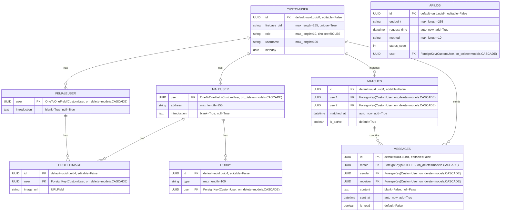

# データベース設計

このプロジェクトのデータベース設計は以下の通りです。

```mermaid
erDiagram
    CUSTOMUSER {
        UUID id PK "default=uuid.uuid4, editable=False"
        string firebase_uid "max_length=255, unique=True"
        string role "max_length=10, choices=ROLES"
        string username "max_length=100"
        date birthday
    }
    MALEUSER {
        UUID user PK "OneToOneField(CustomUser, on_delete=models.CASCADE)"
        string address "max_length=255"
        text introduction "blank=True, null=True"
    }
    FEMALEUSER {
        UUID user PK "OneToOneField(CustomUser, on_delete=models.CASCADE)"
        text introduction "blank=True, null=True"
    }
    PROFILEIMAGE {
        UUID id PK "default=uuid.uuid4, editable=False"
        UUID user FK "ForeignKey(CustomUser, on_delete=models.CASCADE)"
        string image_url "URLField"
    }
    HOBBY {
        UUID id PK "default=uuid.uuid4, editable=False"
        string type "max_length=100"
        UUID user FK "ForeignKey(CustomUser, on_delete=models.CASCADE)"
    }
    APILOG {
        UUID id PK "default=uuid.uuid4, editable=False"
        string endpoint "max_length=255"
        datetime request_time "auto_now_add=True"
        string method "max_length=10"
        int status_code
        UUID user FK "ForeignKey(CustomUser, on_delete=models.CASCADE)"
    }
    MATCHES {
        UUID id PK "default=uuid.uuid4, editable=False"
        UUID user1 FK "ForeignKey(CustomUser, on_delete=models.CASCADE)"
        UUID user2 FK "ForeignKey(CustomUser, on_delete=models.CASCADE)"
        datetime matched_at "auto_now_add=True"
        boolean is_active "default=True"
    }
    MESSAGES {
        UUID id PK "default=uuid.uuid4, editable=False"
        UUID match FK "ForeignKey(MATCHES, on_delete=models.CASCADE)"
        UUID sender FK "ForeignKey(CustomUser, on_delete=models.CASCADE)"
        UUID receiver FK "ForeignKey(CustomUser, on_delete=models.CASCADE)"
        text content "blank=False, null=False"
        datetime sent_at "auto_now_add=True"
        boolean is_read "default=False"
    }
    
    CUSTOMUSER ||--o{ MALEUSER : "has"
    CUSTOMUSER ||--o{ FEMALEUSER : "has"
    MALEUSER ||--o{ PROFILEIMAGE : "has"
    FEMALEUSER ||--o{ PROFILEIMAGE : "has"
    MALEUSER ||--o{ HOBBY : "has"
    CUSTOMUSER ||--o{ MATCHES : "matches"
    CUSTOMUSER ||--o{ MESSAGES : "sends"
    MATCHES ||--o{ MESSAGES : "contains"

```