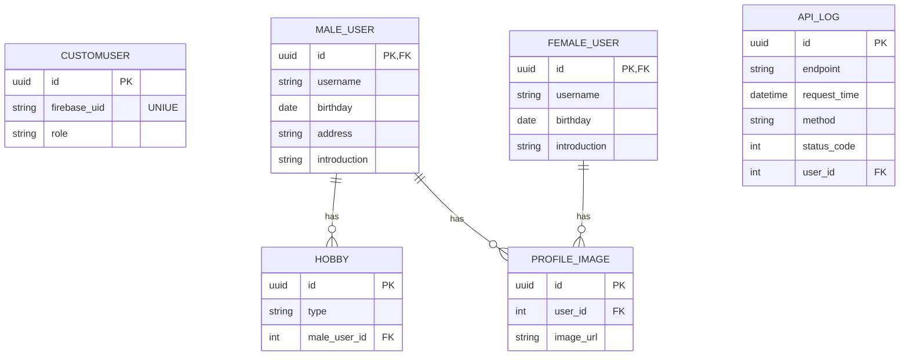

# データベース設計

このプロジェクトのデータベース設計は以下の通りです。

```mermaid
erDiagram
    CUSTOMUSER {
        uuid id PK
        string firebase_uid "UNIUE"
        string role
    }

    MALE_USER {
        uuid id PK,FK
        string username
        date birthday
        string address
        string introduction
    }
    
    FEMALE_USER {
        uuid id PK,FK
        string username
        date birthday
        string introduction
    }

    PROFILE_IMAGE {
        uuid id PK
        int user_id FK
        string image_url
    }
    
    HOBBY {
        uuid id PK
        string type
        int male_user_id FK
    }

    API_LOG {
        uuid id PK
        string endpoint
        datetime request_time
        string method
        int status_code
        int user_id FK
    }

  MALE_USER ||--o{ HOBBY : "has"
  MALE_USER ||--o{ PROFILE_IMAGE : "has"
  FEMALE_USER ||--o{ PROFILE_IMAGE : "has"
```